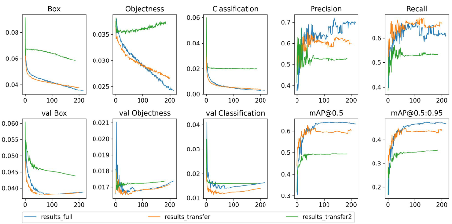
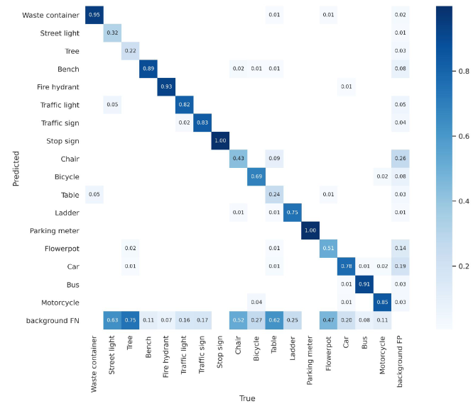
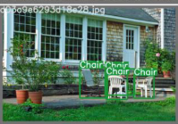
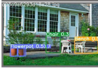

# Practical Machine Learning

In this Readme we describe how to train, run and deply our project of the course. The Project's goal was __Asssting visually impaired people in everyday scenarios through AI__. For this Goal we decided to use YOLOv5 which is optimized for edge devices, such as smartphones. 

## Data Collection and Training

YOLOv5 already exists in a variety of 80 classes, but for our special case we came to the conclusion, that we only need following 17 classes: _'Waste container', 'Street light', 'Tree', 'Bench', 'Fire hydrant', 'Traffic light', 'Traffic sign', 'Stop sign', 'Chair', 'Bycicle', 'Table', 'Ladder', 'Parking meter','Flowerpot', 'Car', 'Bus', 'Motorcycle'_ due to the fact that this are objects which might appear in a blind's person daily walk, and the object dont move itself.

### Data Collection

Unfortunately not all of the Classes were Part of the YOLOv5 model, so we collected new labeled Images for the new classes from the [Open Images Dataset V6](https://storage.googleapis.com/openimages/web/index.html). To be able to use them wen convertet the labels with this [OIDv4_ToolKit](https://github.com/EscVM/OIDv4_ToolKit).

### Training

For the Training you need first download the [YOLOv5 Repo from ultralytics](https://github.com/ultralytics/yolov5). Afterwards run the `requirements.txt` file.
Then you need to create a new or alter the existing `Dataset.yaml` file, to specify the classes and its sample locations. For all Trainings the pretrained weights of the small YOLOv5 model were used.
For the training itself we used the command `python train.py --img 640 --batch 16 --epochs 300 --data yourDataset.yaml --weights yolov5s.pt`. Due to the long training time we tried the training with freezed layers aswell. Just replace the `train.py` with `train_freezed_backbone.py` if u want to freeze the first 10 layers or replace it with `train_freezed_full.py` if you want to freeze all Layers expect the last one. Unfortunately it didn't made as much difference in Training time as we hoped. But we saw a significant decrease in GPU_RAM needed.
The results of the different Training approaches you see in the following Graphic:


Due to this Result, we stick with our full training model (no-freezing). For this Approach we got following Correlation Matrix:


We also observed, that in some Pictures were multiple different objects of different classes. For example here


we four chairs labeled, but we take a look at the prediction 


we obviusoly lost some chairs, but we gained flowerpots and a bench, so it counts as wrong classified, but it is not that easy to say that. This example is just to keep in mind, not to take the Correlation matrix 1 to 1.

## App and model deployment

Our App is based on the official PyTorch Object Detection Demo App that can be found [here][demo].
By doing so we didn´t had to reimplement the post-processing of the output that Yolo style object detector requires to deliver the final results.
This regards the non-maximum-suppression (NMS) wich is reqiured to purge proposals with lower confidence scores from the result set as long as they overlap ones with a higher scores to a certain theshold. To determine this threshold the intersection over union (IoU) has to be computed. [[postprocessing]]

### Distance calculation

We added fucntionality to the app to conduct the distance estimation. For this we need to know the perceived focal length of the device. This parameter is highly hardware dependant and since we had only one physical device (Galaxy S10+) available for development in our group, this parameter has been determined by callibration process during development. In order to support other devices a comprehensive list would be necessary. Alternatively it would be possible to add a callibration activity to the app in order to allow end users to perform the callibration on their own.

### Deployment

Before deploying the trained model to a mobile device it´s neccessary to convert it to a format optimized for the PyTorch mobile lite interpreter. 

```python
model = torch.load('best_jannis_v1.torchscript.pt', map_location=torch.device('cpu'))
model.eval()
scripted_module = torch.jit.script(model)

# Export mobile interpreter version model (compatible with mobile interpreter)
optimized_scripted_module = optimize_for_mobile(scripted_module)
optimized_scripted_module._save_for_lite_interpreter("best_jannis_v1_scripted.ptl")
```

The model prepared as described has to be placed in the assets folder of the Android Studio project and can be loaded with the `LiteModuleLoader` from the PyTorch library.

```java
mModule = LiteModuleLoader.load(MainActivity.assetFilePath(getApplicationContext(), "best_jannis_v1_scripted.ptl"));
```

[demo]: https://github.com/pytorch/android-demo-app/tree/master/ObjectDetection
[postprocessing]: https://towardsdatascience.com/non-maximum-suppression-nms-93ce178e177c

Besides that a textfile is reqiured as an asset to map the model output to the classes it was trained on. This `classes.txt` needs to contain the classes in the ascending order as they were labeled in the training annotations. 
